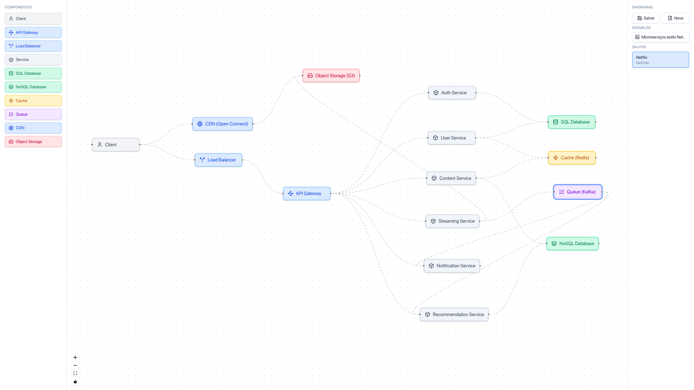

# CloudBoard

Canvas web pra desenhar arquiteturas de sistemas — arraste componentes
(API Gateway, Load Balancer, Cache, Banco, Fila...), conecte-os
visualmente, e salve tudo local no seu navegador. Sem login, sem
backend, sem infra pra manter viva.

Fiz esse projeto com o objetivo de colocar em prática alguns
conhecimentos e usá-lo como material de estudo — tanto de system design
quanto de Vue 3, Vue Flow e desenvolvimento orientado a spec.



## Features

- **Canvas drag-and-drop** com [Vue Flow](https://vueflow.dev) — arraste
  componentes da paleta, conecte com setas, edite labels com duplo clique
- **10 tipos de componente prontos**: Client, API Gateway, Load Balancer,
  Service, SQL/NoSQL Database, Cache, Queue, CDN, Object Storage
- **Salvar/carregar diagramas** direto no `localStorage` do navegador
  (até 10 diagramas, sem conta, sem servidor)
- **Templates prontos** — comece de um exemplo real (arquitetura de
  microserviços estilo Netflix) em vez de canvas em branco
- **Conexões animadas** indicando direção do fluxo
- **Design tokens semânticos** com suporte a dark mode (infra pronta,
  toggle de UI ainda não implementado)

## Stack

Vue 3 + Vite + TypeScript + Tailwind v4 + Vue Flow + Pinia +
[@lucide/vue](https://lucide.dev). Zero backend — persistência 100%
client-side via `localStorage`.

## Rodando localmente

```bash
cd frontend
npm install
npm run dev
```

Abre em `http://localhost:5173`.

### Outros comandos

```bash
npm run build       # build de produção (TypeScript + Vite)
npm run test:unit   # testes unitários (Vitest)
```

## Roadmap

Visão de produto, princípios, stack e próximos passos em
[docs/ROADMAP.md](docs/ROADMAP.md).

## Licença

MIT — veja [LICENSE](LICENSE).
